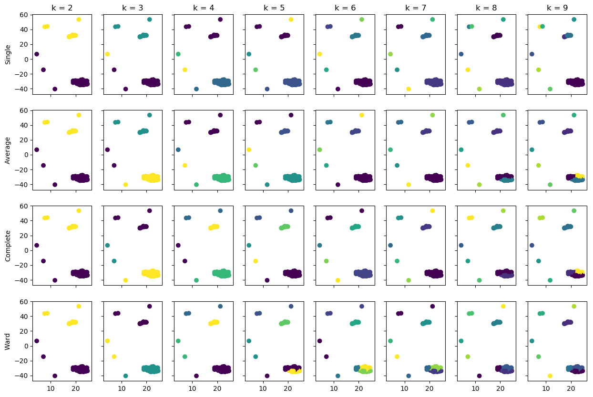
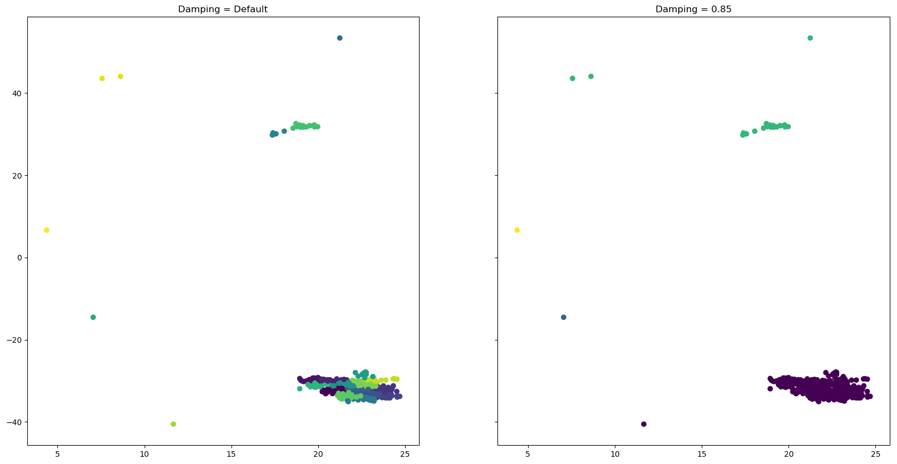

## Clustering MAG contigs with sklearn

**Dr David Waite**
University of Auckland
Genomics Aotearoa
21/11/2019

As part of refining metagenome-assembled genomes (MAGs), we typically go through a process of using a clustering algorithm like [t-SNE](https://en.wikipedia.org/wiki/T-distributed_stochastic_neighbor_embedding). Identifying the 'correct' (or more likely, ideal) MAG boundaries by eye is usually quite easy but trying to automate the process can be problematic, and that's part of what I'm trying to do as part of out pipeline development. One of the biggest difficulties with cluster analysis is that there are so many different methods out there and they all have various strengths and weaknesses. Some of the most common algorithms used in biology include [*k*-means clustering](https://en.wikipedia.org/wiki/K-means_clustering) and variants on [hierarchical clustering](https://en.wikipedia.org/wiki/Hierarchical_clustering). *K*-means clustering in particular suffers from the following assumptions of the data they process:

1. All data points belong in a cluster.
1. Clusters are approximately even in size.
1. The user needs to specify the ideal number of clusters.

While there are a number of techniques for identifying the ideal number of clusters that exist in a data set they can also be a bit subjective in how you interpret them. In the wider world of Data Science, there are a number of more advanced clustering techniques which can be found described [here](https://scikit-learn.org/stable/modules/clustering.html). Depending on what metric you use, clustering algorithms are prone to over- or under-clustering data compard to what we can clearly see in the ordination space. This is a quick walk-through testing some of clustering algorithms I have been experimenting with as part of the [Environmental Metagenomics](https://www.genomics-aotearoa.org.nz/projects/environmental-metagenomics) program under Genomics Aoteoroa.

### Viewing the data

The data used here are the t-SNE coordinates for contigs in a single MAG clustered as part of our Waiwera experiment. All analysis is performed using the *pandas* and *sklearn* libraries in python.

```python
import pandas as pd
import matplotlib.pyplot as plt

df = pd.read_csv('example_data.txt', sep='\t')
plt.scatter(df.V1, df.V2)
plt.savefig('figs/fig_base.png', bbox_inches='tight')
```


From here, it is pretty clear that there is really one large/consistent cluster of contig points, and a number of outliers and smaller clusters. What I want to do here is find an approach that can produce a cluster containing only the main contig points. Lets see what happens if we plot a few different values.

### Clustering with *k*-means and hierarchical clustering

Before we begin, in the *sklearn* library, hierarchical clustering is referred to as agglomerative clustering. Awkwardly, *k*-means clustering requires us to know the number of clusters present in the data to begin with.

```python
from sklearn.cluster import KMeans

k_clust = []

for i in range(2, 10):
    k = KMeans(n_clusters=i, random_state=12345).fit_predict(df)
    k_clust.append(k)
```

Now I'll plot these out, using the python library *itertools* to organise the panels nicely.

```python
from itertools import product

fig, ax = plt.subplots(nrows=2, ncols=4, sharex=True, sharey=True)
fig.set_size_inches(20, 10)

k=0
for r, c in product([0, 1], [0, 1, 2, 3]):
    ax[r,c].scatter(df.V1, df.V2, c=k_clust[k])
    ax[r,c].set_title( 'k = {}'.format(k+2) )
    k += 1

plt.savefig('figs/fig_kmeans.png', bbox_inches='tight')
```


As you can see here, as *k* steps from 2 to 3 we appear to be narrowing in on the correct location. However, once we step to *k* = 4, the major cluster is broken up while **still** including an 'outlier' contig in one of these clusters. How does it look with hierarchical clustering? For the sake of keeping this exercise simple, I will only use Euclidean distances. However, there are fours ways this clustering technique can be employed in *sklearn*:

1. Single linkage/nearest neighbor
1. Average linkage
1. Complete linkage/furthest neighbor
1. Ward

```python
from sklearn.cluster import AgglomerativeClustering

sl_clust = []
al_clust = []
cl_clust = []
w_clust = []

for i in range(2, 10):
    sl_clust.append( AgglomerativeClustering(n_clusters=i, linkage='single', affinity='euclidean').fit_predict(df) )
    al_clust.append( AgglomerativeClustering(n_clusters=i, linkage='average', affinity='euclidean').fit_predict(df) )
    cl_clust.append( AgglomerativeClustering(n_clusters=i, linkage='complete', affinity='euclidean').fit_predict(df) )
    w_clust.append( AgglomerativeClustering(n_clusters=i, linkage='ward', affinity='euclidean').fit_predict(df) )
```

Now let's plot this out. This is going to get a bit messy, so I'm going to define a simple [generator](https://wiki.python.org/moin/Generators) to simplify the the code.

```python

def get_plot_values():
    row_index = [ x for x in range(0, 4) ]
    method_names = ['Single', 'Average', 'Complete', 'Ward']
    cluster_lists = [sl_clust, al_clust, cl_clust, w_clust]
    for (r, m, c) in zip(row_index, method_names, cluster_lists):
        yield r, m, c

fig, ax = plt.subplots(nrows=4, ncols=8, sharex=True, sharey=True)
fig.set_size_inches(15, 10)

# Plot the data
for row, method, cluster_list in get_plot_values():
    for col, clust in enumerate(cluster_list):
        ax[row, col].scatter(df.V1, df.V2, c=clust)

# Label the axes
ax[0,0].set_ylabel('Single')
ax[1,0].set_ylabel('Average')
ax[2,0].set_ylabel('Complete')
ax[3,0].set_ylabel('Ward')

for i in range(0, len(sl_clust)):
    ax[0, i].set_title( 'k = {}'.format( i + 2 ) )

plt.savefig('figs/fig_hclust.png', bbox_inches='tight')
```



As you can see, there are a few permutations of linkage method and number of clusters that correctly bins the cluster of interest. For example

1. Single linkage k = 7
1. Single linkage k = 8
1. Average linkage k = 7
1. Complete linkage k = 6
1. Complete linkage k = 7

But this is not a very good way of finding that out. In addition, I would need to check out every sample in advance to work out the correct permutation to use. In the Waiwera data set that we use in the Environmental Metagenomics program, we have a total of 660 MAGs, and there are 24 permutations considered here. That's not practical. We're therefore going to look at the default behaviours of several more advanced clustering algorithms and see if there are any that can correctly cluster the 'main' group of contigs without exhaustively working through the parameter space.

### Clustering with Spectral Clustering

```python
from sklearn.cluster import SpectralClustering

sc_clust = SpectralClustering(assign_labels='discretize', random_state=12345).fit_predict(df)
```

Unlike the previous methods, spectral clustering can automatically determine the 'ideal' number of clusters. To quickly determine how many were picked, and check the distribution of clusters, we can tally up the frequency of each bin in the output using the *Counter* function.

```python
from collections import Counter

Counter(sc_clust)
# Counter({3: 130, 4: 110, 1: 102, 0: 28, 6: 5, 2: 4})
```

That distribution looks strange - most of the contigs fall into two different bins. What does this look like?

```python
plt.clf()
plt.scatter(df.V1, df.V2, c=sc_clust)
plt.savefig('figs/fig_spectral.png', bbox_inches='tight')
```


That's not helpful...

### Clustering with Affinity Propagation

The Affinity Propagation algorithm is another way to try to cluster points. However, it can be sensitive to the value of the *damping factor* parameter, so I will test it out using both the defaul value of 0.5 and and aribtrarily higher value of 0.85.

```python
from sklearn.cluster import AffinityPropagation

ap_clust_50 = AffinityPropagation().fit_predict(df)
ap_clust_85 = AffinityPropagation(damping=0.85).fit_predict(df)

# Check the number of clusters created
len( Counter(ap_clust_50) )# 21
len( Counter(ap_clust_85) ) # 4
```

That's a pretty big difference in the number of clusters identified. What do these look like?

```python
fig, ax = plt.subplots(nrows=1, ncols=2, sharex=True, sharey=True)
fig.set_size_inches(20, 10)

ax[0].scatter(df.V1, df.V2, c=ap_clust_50); ax[0].set_title('Damping = Default')
ax[1].scatter(df.V1, df.V2, c=ap_clust_85); ax[1].set_title('Damping = 0.85')

plt.savefig('figs/fig_affprop.png', bbox_inches='tight')
```



That looks terrible at the default value, although the clustering does resolve nicely with a damping factor of 0.85. This could be problematic though as we already stated that having to iterate over the parameter space is not desireable. Out of interest, how does the number of clusters vary with the *damping factor*?

```python
import numpy as np

n_clusters = []

for d in np.arange(0.5, 1., 0.01):
    ap_clust = AffinityPropagation(damping=d).fit_predict(df)
    n = len( Counter(ap_clust) )
    n_clusters.append(n)

plt.clf()
plt.scatter([ i for i in range(0, len(n_clusters)) ], n_clusters)
plt.savefig('figs/fig_affprop_clusters.png', bbox_inches='tight')
```


That collapse is pretty convincing, so for the sake of argument we'll call the ideal result affinity propagation 4 clusters.

### Clustering with Birch clustering and DBSCAN

Birch clustering is a very nice algorithm that I've used successfully in a number of projects, and I like DBSCAN for its ability to determine that data points do not belong to any cluster (which it calls cluster -1).

```python
from sklearn.cluster import Birch, DBSCAN

bi_clust = Birch().fit_predict(df)
db_clust = DBSCAN().fit_predict(df)
```

For plotting the DBSCAN result, we'll need to relabel the colouring vector to specify a colour for the contigs that do not belong to any cluster. This will be a pale gray so that they're not obtrusive  in the plot.

```python
fig, ax = plt.subplots(nrows=1, ncols=2, sharex=True, sharey=True)
fig.set_size_inches(20, 10)

ax[0].scatter(df.V1, df.V2, c=bi_clust); ax[0].set_title('Birch')

Counter(db_clust)
#Counter({0: 326, 1: 25, -1: 12, 2: 11, 3: 5})

db_colours = { -1: 'lightgray', 0: 'red', 1: 'pink', 2: 'gray', 3: 'lightblue'}

ax[1].scatter(df.V1, df.V2, c=[ db_colours[d] for d in db_clust ]); ax[1].set_title('DBSCAN')
plt.savefig('figs/fig_dbscan.png', bbox_inches='tight')
```


Birch cluster looks comparable to affinity propagation with a high damping factor, DBSCAN seems to have identified the major clade of clusters whiel only discarding a few edge cases.

### Summarising the results for complex clusting methods

Based on each of these cluster methods, how many contigs ended up in the 'main' bin?

```python
def find_clade_proportion(cluster_list):
    counter_dict = Counter(cluster_list)
    most_freq = max( counter_dict.values() )
    total = len( cluster_list )
    return most_freq / float(total)

name_list = ['Spectral Clustering', 'Affinity Propagation (50)', 'Affinity Propagation (85)', 'Birch', 'DBSCAN']
clust_list = [sc_clust, ap_clust_50, ap_clust_85, bi_clust, db_clust]

for name, clust in zip(name_list, clust_list):
    clust_pc = find_clade_proportion(clust)
    print( '{}: {:.0%}'.format(name, clust_pc) )
```

* Spectral Clustering: 34%
* Affinity Propagation (default): 10%
* Affinity Propagation (85): 91%
* Birch: 91%
* DBSCAN: 86%

So there's a pretty clear signal here that any of the last three methods are doing a good job of finding the cluster. How reproducible is this signal over the full data set?

```python
full_df = pd.read_csv('full_data.txt', sep='\t')

def determine_cluster_AP(data_slice, d=0.5):
    a = AffinityPropagation(damping=d).fit_predict( data_slice[ ['V1', 'V2'] ] )
    return find_clade_proportion(a)

def determine_cluster_B(data_slice):
    b = Birch().fit_predict( data_slice[ ['V1', 'V2'] ] )
    return find_clade_proportion(b)

def determine_cluster_DB(data_slice):
    d = DBSCAN().fit_predict( data_slice[ ['V1', 'V2'] ] )
    return find_clade_proportion(d)

affprop_spread = [ determine_cluster_AP(b) for _, b in full_df.groupby('Bin') ]
affprop85_spread = [ determine_cluster_AP(b, 0.85) for _, b in full_df.groupby('Bin') ]
birch_spread = [ determine_cluster_B(b) for _, b in full_df.groupby('Bin') ]
dbscan_spread = [ determine_cluster_DB(b) for _, b in full_df.groupby('Bin') ]

plt.clf()

fig = plt.figure()
ax = fig.add_subplot(111)
_ = ax.violinplot([affprop_spread, affprop85_spread, birch_spread, dbscan_spread], showmeans=False, showmedians=True)

ax.set_xticks([0, 1, 2, 3, 4])
ax.set_xticklabels(['', 'AffProp (0.5)', 'AffProp (0.85)', 'Birch', 'DBSCAN'])

plt.savefig('figs/fig_fulldata.png', bbox_inches='tight')
```


So across our full data set, Birch clustering and DBSCAN work very well to pull out the main cluster in the data. This isn't too surprising when considering the initial findings from the test data, because although this second data set has a lot more MAGs to process (59, including the original) the general output pattern from the t-SNE algorithm is the same for each bin. Therefore, all the intrinsic assumptions about MAG contig density and clustering shapes are reasonably preserved across the full data set.

### Conclusion

Clustering is a tricky business to get into, especially if you need to rely on a fully automated system. However, there are many different clustering approaches out there and many of these are not well known in biology. Testing out the different approaches is a worthwhile investment of time, and can be a good way to explore the patterns in your data.
