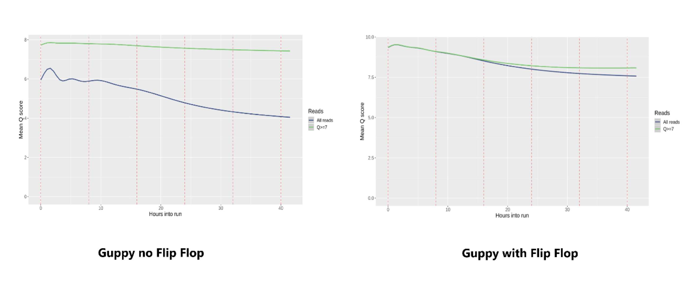

**Re-base-calling my Oxford Nanopore data?**

Oxford Nanopore Technologies (ONT) are reliant on the production of an
electrical amplification signal generated by the flowing of a DNA
molecule through a biologically derived nanopore attached to a silicon
chip. DNA is composed of nucleotide bases A, G, C and T. The
amplification current is measured 33,000 times per second per pore with
each nucleotide base having its own unique signal. This data is
extracted and utilised by base-calling software packages to infer the
sequence of an input DNA molecule.

To decode the amplification signal, software packages use neural
networks to identify each individual base as it flows through the pore
resulting in a DNA sequence. This is known as base-calling. However,
these neural networks need to be trained using machine learning tools to
decode this amplification signal accurately, therefore; base-calling
software packages are dependent on high quality training sets. Due to
this fact bases can be called inaccurately resulting in low quality
scores (q-scores/phred scores). Inaccurate base-calling can occur
randomly but more commonly occurs due to flatlining signal amplification
caused by homopolymer stretches of DNA or noisy signals caused by DNA
modifications such as methylation.

In 2017, ONT released Albacore v2.0.1, a CPU driven base-calling
software package that improved the accuracy of individual read base
calling which in turn improved the downstream consensus genome assembly.
Albacore was maintained and updated since then and its final version
could base-call reads from the latest ONT technology. However, even the
latest versions of the Albacore software in combination with R9 pores
struggled to provide accurate calls on methylated bases and
homopolymers.

In an attempt to deal with these issues ONT replaced Albacore with a new
software package called Guppy. The Guppy base-caller has similar q-score
(quality) accuracy to Albacore but with a dramatically quicker call rate
due to its utilisation of GPUs (Graphics Processing Units). Since then,
Guppy V2 has been released and is now the default base-calling software
used on the new R10 pore technology. This combination has been shown to
increase individual read q-scores but has little effect or even negative
effects on consensus assembly accuracy. The most recent update of Guppy
V2 implements an algorithm known as flip-flop. Simply put, the
implementation of flip-flop allows more time before it definitively
settles on calling a base - allowing it to flip-flop between base calls
for improved accuracy. This was designed to address the issue of
base-calling long homopolymer stretches. Results produced locally
indicate that this new base caller and algorithm produce higher quality
reads which in turn also produce improved consensus assemblies.

As part of Genomics Aotearoa NeSI has provided us with access to two
GPUs, each with four nodes. Re-calling data using GPUs is
computationally intense (1 GPU = 56 CPU hours) and by running these jobs
it lowers our priority to run other jobs on the system. So, I've started
to question, does all data require recalling with the latest flip-flop
algorithm? Will it affect my read accuracy? Will it affect my consensus
assembly N50? Will it affect the number of genes predicted (BUSCO
score)?

I have collected data from four projects that have implemented the
flip-flop algorithm to illustrate my current understanding of when and
why you may want to recall your data. These projects are the Rewarewa -
*Knightia excelsa* (David\_Chagne), *Clitarchus hookeri*
(Thomas\_Buckley), stem weevil (Tom Harrop), and an endemic fungal
species (Chris Smith).

1.  Recalling your data using the Guppy flip-flop always increases the
    q-score of your individual raw reads -- regardless of whether you
    have used Albacore or Guppy\_v2 without flip-flop, you will still
    see a difference (See Table 1 below and Figure 1).

    **Table 1: Illustrates the impact guppy flip-flop has on the
    individual raw read q-scores across 4 species.**

  |**Species**                         |**Algorithm used**|**Q-score**
  |------------------------------------|------------------|-----------
  |**Rewarewa - *Knightia excelsa***   |Guppy version 2   |   5.7
  |**Rewarewa - *Knightia excelsa***   |Guppy flip flop   |   9.11
  |**Stem Weevil**                     |Albacore          |   9.0
  |**Stem Weevil**                     |Guppy flip flop   |   9.9
  |***Clitarchus hookeri***            |Guppy version 2   |   7
  |***Clitarchus hookeri***            |Guppy flip flop   |   12.4
  |**Fungal Species 1**                |Albacore          |   6.6
  |**Fungal Species 1**                |Guppy flip flop   |   8.9

2.  Depending on your coverage, recalling your data has different
    effects on your consensus assembly (N50 score), see Table 2. At high
    coverage, read depth should eliminate random base-calling errors
    during the DeBruijn graph construction step of the assembly.

    **Table 2: Illustrates the impact guppy flip-flop has on the
    consensus assembly N50 scores across 4 species.**

  |**Species** | **Assembler** | **N50 w/o Flip-flop** | **N50 with Flip-flop**
  |------------|---------------|-----------------------|----------------------
  **Stem Weevil**  |          Flye |           8807 Mb     |            8547 Mb
  **Fungi**         |         Canu |           176,854     |            205,551
  ***Clitarchus hookeri*** |  Flye |           503,075     |            560,188
  **Rewarewa**          |     Flye |           INSERT\_RESULT |         538,393

3.  An improvement in assembly is seen after polishing the consensus
    assembly with RACON with error corrected reads (not N50 based but
    the number of completed genes found) (See Table 3 and Table 4).

    **Table 3: Illustrates the impact guppy flip-flop error corrected
    reads have on the consensus assembly BUSCO scores, when used for
    polishing genomes with RACON \[C = Completed single copy genes, F =
    Fragmented genes, and M = Missing genes\].**

  | **Species** | **BUSCO w/o Flip-flop** | **BUSCO with Flip-flop**
  |-------------|-------------------------|----------------------------
  **Stem Weevil** |  C:49.9%: F: 16.6%: M:33.5%  | C:67.8%: F: 14.5%: M:17.7%
  **Fungi**   |   C: 59.2%: F:19.5%: M:20.3% |  C:83.2%: F:5.1%: M:4.6%
  ***Clitarchus hookeri*** |  C: 61%: F: 8%  | C:88.2%: F:5.5%: M:6.3%

**Table 4: Summary of Clitarchus hookeri re-base-calling using Guppy
Flip-Flop**

  | **Clitarchus hookeri Analysis** | **Flye+R** | **Guppy\_Flye** | **Guppy\_flye\_racon**  
  |-----|-----|-----|-----|  
  | **QUAST RESULTS**  |        |       |    
  | \# contigs (\>= 0 bp)      |      16763    |   14932       |     12319
  | \# contigs (\>= 1000 bp)   |      16271    |   13443       |     12074
  | \# contigs (\>= 5000 bp)   |      14371    |   10925       |     10784
  | \# contigs (\>= 10000 bp)  |      12962    |   9981        |     9975
  | \# contigs (\>= 25000 bp)  |      10647    |   8724        |     8743
  | \# contigs (\>= 50000 bp)  |      8634     |   7392        |     7427
  | Total length (\>= 0 bp)    |      2.89E+09 |   2672913182  |      2708652124
  | Total length (\>= 1000 bp) |      2.89E+09 |   2671885269  |     2708470509
  | Total length (\>= 5000 bp) |      2.89E+09 |   2665245223  |     2704695338
  | Total length (\>= 10000 bp)|      2.88E+09 |   2658554578  |     2698902733
  | Total length (\>= 25000 bp)|      2.84E+09 |   2637666894  |     2678423657
  | Total length (\>= 50000 bp)|      2.76E+09 |   2588934179  |     2630377000
  | \# contigs                        15473    |   14932       |     12314
  | Largest contig                    3917093  |   3550494     |     3603931
  | Total length                      2.89E+09 |   2672913182  |     2708650093
  | GC (%)                            39.28    |   39.07       |     39.02
  | N50                               503075   |   560188      |     570203
  | N75                               244535   |   283229      |     289278
  | L50                               1668     |   1387        |     1382
  | L75                               3698     |   3050        |     3035
  | \# N\'s per 100 kbp               0.32     |   0.41        |     0
  | **BUSCO RESULTS**                          |               |      
  | Complete BUSCO (%)                61%      |   71.60%      |     88.20%
  | Partial BUSCO (%)                 8%       |   9.20%       |     5.50%

**Figure 1:** Images of the mean quality score of base-calls over the
course of the Rewarewa sequencing run both with (left) and without
(right) the implementation of the Guppy flip-flop algorithm.

In my opinion I recommend re-base-calling of data with guppy flip-flop.
However, before doing so, I think it is important to consider the
computational intensity required. You should coordinate with NeSI
support prior to submitting your job to optimise your slurm script to
prevent the unnecessary wastage of computational resources and to limit
the impact on the priority of other jobs you wish to run simultaneously.

**References:**

<https://www.biorxiv.org/content/biorxiv/early/2019/02/07/543439.full.pdf>

Watch:
<https://nanoporetech.com/about-us/news/clive-g-brown-nanopore-community-meeting-2018-talk>
